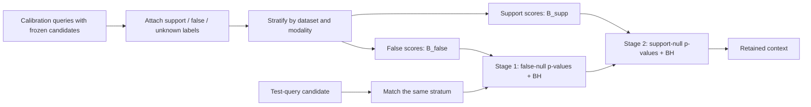

# Báo cáo Đồ án Tổng hợp: Conformal Selection cho RAG

**Thiết lập:** 1.000 câu calibration và 100 câu test cho mỗi dataset. Báo cáo tập trung vào việc chọn và cắt tỉa chunk **sau khi retriever đã trả candidate pool**. Precision và recall là micro-metrics trên các chunk có nhãn support trong candidate pool; F1 là harmonic mean của hai chỉ số này.

---

## 1. Phương pháp Two-Stage Conformal Selection

Cho truy vấn $q$ và candidate pool đã được retrieval $\mathcal{C} = \{c_1, \ldots, c_N\}$, mỗi chunk $c_i$ có similarity score $s_i=s(q,c_i)$. Mục tiêu là xác định tập context $\mathcal{S}\subseteq\mathcal{C}$ có đủ evidence hỗ trợ cho truy vấn, đồng thời giảm các chunk nhiễu trước khi đưa vào generator.

### 1.1. Dữ liệu đầu vào và nhãn calibration

Reference bank được xây dựng hoàn toàn từ các query thuộc $\mathcal{D}_{cal}$, tách rời tập test theo `qid`. Với mỗi query calibration, retrieval log lưu từng candidate đã trả về cùng score và nhãn evidence. Một record tối thiểu có dạng:

| Trường | Vai trò trong reference bank |
|---|---|
| `qid`, `dataset` | xác định query và ngăn overlap giữa calibration/test |
| `chunk_id`, `rank`, `modality` | xác định candidate và stratum của candidate |
| `cosine_score` | score $s(q,c)$ dùng để lập phân bố tham chiếu |
| `support_label` | `support`, `false`, hoặc `unknown` |
| retriever, corpus, preprocessing, Top-L | fingerprint của retrieval pipeline |

`support` là chunk được annotation là evidence cho đáp án; `false` là candidate được annotation là không hỗ trợ; `unknown` không được đưa vào hai bank. Score trong calibration và test phải đến từ cùng embedding/retrieval pipeline, cùng corpus revision, preprocessing và candidate depth. Điều này giữ cho score của test được so sánh với một phân bố cùng thang đo.

### 1.2. Cách xây dựng false và support reference banks

Mỗi candidate được gán vào một stratum $g$. Cấu hình cơ bản là $g=(\text{dataset},\text{modality})$; khi dữ liệu đủ lớn, stratum có thể bổ sung `query_type` và `rank_bin`. Ví dụ, score của một table candidate ở rank 6 của MMQA chỉ được so với các calibration scores trong stratum MMQA–table–rank-bin tương ứng.

Với mỗi stratum $g$, hai bank được tạo và sắp xếp tăng dần:

$$
\mathcal{B}^{g}_{false}=\operatorname{sort}\{s(q,c):(q,c)\in\mathcal{D}_{cal},\;y(q,c)=\mathrm{false},\;g(q,c)=g\},
$$

$$
\mathcal{B}^{g}_{supp}=\operatorname{sort}\{s(q,c):(q,c)\in\mathcal{D}_{cal},\;y(q,c)=\mathrm{support},\;g(q,c)=g\}.
$$

Như vậy, mỗi score calibration được dùng đúng một lần theo nhãn và stratum của nó: false score đi vào $\mathcal{B}^{g}_{false}$, support score đi vào $\mathcal{B}^{g}_{supp}$, còn unknown score không ảnh hưởng tới p-value. Mỗi bank lưu số lượng phần tử $m_g$, điều kiện đã dùng, fingerprint pipeline và danh sách score đã sắp xếp. Những strata có $m_g$ dưới ngưỡng tối thiểu được đánh dấu để xử lý theo chính sách đã định trước, chẳng hạn thu thập thêm calibration data hoặc dùng một fallback stratum đã được xác định trước.

### 1.3. Stage 1: loại trừ giả thuyết false evidence

Với mỗi chunk test $c_i$, xác định stratum $g_i=g(q,c_i)$ rồi lấy đúng bank $\mathcal{B}^{g_i}_{false}$. Stage 1 đặt giả thuyết $\mathcal{H}_0^{(1)}$ rằng score của chunk được sinh từ bank false tương ứng. Upper-tail conformal p-value là

$$
p_i^{(1)}=
\frac{1+|\{s_j\in\mathcal{B}^{g_i}_{false}:s_j\ge s_i\}|}
{|\mathcal{B}^{g_i}_{false}|+1}.
$$

Benjamini–Hochberg (BH) được áp dụng trên các p-value của một query. Các chunk bị bác bỏ $\mathcal{H}_0^{(1)}$ được giữ trong $\mathcal{S}_1$. Tham số $\alpha_1$ điều chỉnh mức chọn evidence ở stage này: giá trị lớn hơn dẫn tới context rộng hơn và thường giữ lại nhiều support hơn.

### 1.4. Stage 2: kiểm tra độ phù hợp với support bank

Stage 2 xem từng $c_i\in\mathcal{S}_1$ với support bank cùng stratum $\mathcal{B}^{g_i}_{supp}$. Giả thuyết $\mathcal{H}_0^{(2)}$ cho rằng score của candidate phù hợp với phân bố support. Lower-tail p-value là

$$
p_i^{(2)}=
\frac{1+|\{s_k\in\mathcal{B}^{g_i}_{supp}:s_k\le s_i\}|}
{|\mathcal{B}^{g_i}_{supp}|+1}.
$$

BH trên $\{p_i^{(2)}\}$ đánh dấu các chunk có score thấp bất thường so với support bank; các chunk này được loại khỏi $\mathcal{S}_1$. $\alpha_2$ vì vậy là tham số kiểm soát cường độ pruning ở Stage 2.

### 1.5. Context cuối cùng và biến thể Top-10 + Stage 2

Các candidate còn lại sau Stage 2 tạo thành context cuối cùng. Nếu áp dụng context cap $K$, chính sách cap cần được cố định trước khi test, chẳng hạn giữ tối đa $K$ candidate còn lại theo thứ tự retrieval rank. Biến thể **Top-10 + Stage 2** dùng mười candidate có score retrieval cao nhất làm input của Stage 2; cách này cố định ngân sách context đầu vào trước khi thực hiện support-null pruning.

---

## 2. Literature review: conformal xử lý candidate sau retrieval

Ba công trình dưới đây đều bắt đầu từ candidate đã retrieval, nhưng dùng những đối tượng hiệu chuẩn và mục tiêu đầu ra khác nhau.

| Công trình | Nơi công bố, năm, rank | Xử lý sau retrieval |
|---|---|---|
| **Conformal Context Engineering (CCE)** — Chakraborty et al. | **ECIR 2026**, proceedings; **CORE/ICORE A** | Với Conformal-Embedding, đặt nonconformity $A(q,c)=1-\cos(e_q,e_c)$ trên các relevant snippet ở calibration. Ngưỡng là quantile $(1-\alpha)$ của $A$; tại test giữ chunk khi $A(q,c)\le\hat\tau_\alpha$. Bài báo cũng đánh giá một biến thể dùng LLM relevance score. |
| **CONFLARE** — Rouzrokh et al. | **arXiv:2404.04287, 2024**; preprint, không có rank hội nghị/tạp chí | Calibration tạo các question có thể trả lời từ corpus, ghi cosine distance của relevant chunk. Sau retrieval, giữ tất cả chunk có cosine distance nhỏ hơn percentile $(1-\alpha)$ của các calibration distances. |
| **TRAQ** — Li et al. | **NAACL-HLT 2024, Long Papers**; **CORE/ICORE A** | TRAQ đặt một conformal threshold cho retrieval score và một threshold khác cho score của prediction set từ generator. Bonferroni hoặc Bayesian optimization phân bổ $\alpha$ giữa retrieval và answer-set; chỉ các passages vượt retrieval threshold được chuyển sang bước tạo và gom semantic answer set. |

CCE nhìn việc lọc context như bài toán giữ coverage của relevant snippets. CONFLARE sử dụng một similarity/distance cutoff học từ calibration records. TRAQ ghép coverage của passage retrieval với coverage của answer set, nên retrieval threshold là một thành phần của pipeline end-to-end.

Phương pháp Two-Stage cũng làm việc trên candidate đã retrieval, nhưng dùng hai reference banks có vai trò đối xứng: Stage 1 tìm evidence khác biệt với false bank, sau đó Stage 2 loại evidence yếu so với support bank. Thủ tục được chạy theo query và có thể conditioning theo modality. Cấu trúc này tạo hai nút điều chỉnh riêng cho evidence retention và pruning; đây là hướng có tiềm năng để khảo sát trade-off precision–recall thay vì chỉ thay đổi một global similarity cutoff. Các bước hoàn thiện tiếp theo gồm đánh giá độ ổn định khi thay đổi calibration size, ablation theo modality, và kiểm tra các điều kiện bảo đảm của thủ tục hai stage có context cap.

---

## 3. Tổng hợp kết quả selection

Các kết quả được tách theo split để mỗi phép so sánh dùng cùng calibration queries, test queries và frozen candidate pool. Bảng **matched comparison** dưới đây dùng đúng `splits_khanh_27_09.zip`: 1.000 calibration qids và 100 held-out test qids cho mỗi dataset. Ba hàng literature đã chạy xong nằm trong [artifact split-specific](research/internal_state_rag/results/full_context_selection_splits_khanh_27_09_2026_09_27/REPORT.md); các phương pháp còn lại trong artifact đó được giữ là `pending` đến khi chạy trên cùng split.

### 3.1. Matched comparison trên `splits_khanh_27_09`

Selection F1 là harmonic mean của precision và recall ở cấp chunk. QA token F1 là kết quả Qwen2-VL-7B direct-answer trên cùng 100 test queries.

| Dataset | Method | Chunks | Precision | Recall | Selection F1 | Empty | QA token F1 |
|---|---|---:|---:|---:|---:|---:|---:|
| HotpotQA | CCE Conformal-Embedding ($\alpha=.10$) | 8.61 | 21.0% | 90.5% | 34.1% | 2.0% | 65.3% |
| HotpotQA | CONFLARE source-question ($\alpha=.10$) | 7.05 | 21.0% | 74.0% | 32.7% | 3.0% | 62.3% |
| HotpotQA | TRAQ retrieval Bonferroni ($\alpha=.10,\alpha_R=.05$) | 8.17 | 21.4% | 87.5% | 34.4% | 2.0% | 64.2% |
| MMQA | CCE Conformal-Embedding ($\alpha=.10$) | 18.40 | 7.7% | 91.0% | 14.2% | 2.0% | 43.6% |
| MMQA | CONFLARE source-question ($\alpha=.10$) | 18.05 | 7.8% | 90.3% | 14.4% | 2.0% | 46.2% |
| MMQA | TRAQ retrieval Bonferroni ($\alpha=.10,\alpha_R=.05$) | 19.50 | 7.5% | 94.2% | 13.9% | 2.0% | 43.5% |
| TAT-QA | CCE Conformal-Embedding ($\alpha=.10$) | 5.01 | 24.6% | 91.8% | 38.8% | 1.0% | 49.0% |
| TAT-QA | CONFLARE source-question ($\alpha=.10$) | 4.64 | 25.0% | 86.6% | 38.8% | 2.0% | 43.2% |
| TAT-QA | TRAQ retrieval Bonferroni ($\alpha=.10,\alpha_R=.05$) | 5.09 | 24.6% | 93.3% | 38.9% | 1.0% | 50.0% |
| WebQA | CCE Conformal-Embedding ($\alpha=.10$) | 23.36 | 6.5% | 86.3% | 12.1% | 0.0% | 26.0% |
| WebQA | CONFLARE source-question ($\alpha=.10$) | 21.60 | 6.8% | 83.4% | 12.6% | 0.0% | 25.5% |
| WebQA | TRAQ retrieval Bonferroni ($\alpha=.10,\alpha_R=.05$) | 24.68 | 6.3% | 88.6% | 11.8% | 0.0% | 24.6% |

### 3.2. Sweep Two-Stage lịch sử

Các bảng dưới đây lưu lại sweep Two-Stage từ báo cáo nguồn trước đó. Những hàng CCE/CONFLARE/TRAQ trong sweep này được ghi đúng là cosine proxy lịch sử; matched literature comparison dùng các hàng ở Mục 3.1.

### HotpotQA

| Method | Kept Chunks | Precision | Recall | F1 Score |
| :--- | :--- | :--- | :--- | :--- |
| Fixed Top-10 | 9.85 | 20.3% | 100.0% | 33.7% |
| Fixed Top-5 | 4.95 | 33.7% | 83.5% | 48.1% |
| CCE-style positive-cosine proxy (historical sweep) | 6.17 | 29.1% | 90.0% | 44.0% |
| CONFLARE-style positive-cosine proxy (historical sweep) | 6.17 | 29.2% | 90.0% | 44.1% |
| TRAQ-style positive-cosine proxy (historical sweep) | 7.45 | 25.0% | 93.0% | 39.4% |
| Proposed Stage 1 ($\alpha_1=0.1$) | 0.89 | 55.1% | 24.5% | 33.9% |
| Proposed Stage 1 ($\alpha_1=0.9$) | 8.11 | 22.3% | 90.5% | 35.8% |
| Proposed Stage 1 ($\alpha_1=0.99$) | 9.59 | 20.5% | 98.5% | 33.9% |
| Proposed Two-Stage ($\alpha_1=0.99, \alpha_2=0.15$) | 6.92 | 26.4% | 91.5% | 41.0% |
| Proposed Two-Stage ($\alpha_1=0.99, \alpha_2=0.20$) | 6.08 | 29.6% | 90.0% | 44.5% |
| Proposed Two-Stage ($\alpha_1=0.99, \alpha_2=0.30$) | 5.15 | 32.2% | 83.0% | 46.4% |
| Proposed Top-10 + Stage 2 ($\alpha_2=0.15$) | 6.94 | 26.4% | 91.5% | 40.9% |
| Proposed Top-10 + Stage 2 ($\alpha_2=0.20$) | 6.09 | 29.6% | 90.0% | 44.5% |
| Proposed Top-10 + Stage 2 ($\alpha_2=0.30$) | 5.15 | 32.2% | 83.0% | 46.4% |
| Proposed Top-10 + Stage 2 ($\alpha_2=0.40$) | 3.85 | 36.9% | 71.0% | 48.5% |
| Proposed Top-10 + Stage 2 ($\alpha_2=0.50$) | 2.85 | 42.5% | 60.5% | 49.9% |
| Proposed Top-10 + Stage 2 ($\alpha_2=0.60$) | 1.83 | 47.0% | 43.0% | 44.9% |
| Proposed Top-10 + Stage 2 ($\alpha_2=0.70$) | 1.27 | 47.2% | 30.0% | 36.7% |
| Proposed Top-10 + Stage 2 ($\alpha_2=0.80$) | 0.89 | 50.6% | 22.5% | 31.1% |
| Proposed Top-10 + Stage 2 ($\alpha_2=0.90$) | 0.44 | 61.4% | 13.5% | 22.1% |

Ở HotpotQA, các cấu hình $\alpha_2$ tăng dần tạo một đường trade-off rõ: số chunk giảm từ 6.94 xuống 0.44, precision tăng từ 26.4% lên 61.4%, còn recall giảm từ 91.5% xuống 13.5%. F1 cao nhất trong các cấu hình proposed ở $\alpha_2=0.50$ (49.9%).

### MMQA

| Method | Kept Chunks | Precision | Recall | F1 Score |
| :--- | :--- | :--- | :--- | :--- |
| Fixed Top-10 | 10.00 | 14.1% | 91.0% | 24.4% |
| Fixed Top-5 | 5.00 | 24.0% | 77.4% | 36.6% |
| CCE-style positive-cosine proxy (historical sweep) | 11.58 | 12.4% | 92.9% | 21.9% |
| CONFLARE-style positive-cosine proxy (historical sweep) | 11.58 | 12.3% | 92.3% | 21.7% |
| TRAQ-style positive-cosine proxy (historical sweep) | 13.79 | 10.9% | 97.4% | 19.6% |
| Proposed Stage 1 ($\alpha_1=0.1$) | 0.59 | 38.6% | 14.8% | 21.4% |
| Proposed Stage 1 ($\alpha_1=0.9$) | 6.85 | 16.7% | 74.2% | 27.3% |
| Proposed Stage 1 ($\alpha_1=0.99$) | 9.43 | 14.1% | 85.8% | 24.2% |
| Proposed Two-Stage ($\alpha_1=0.99, \alpha_2=0.15$) | 9.26 | 14.4% | 85.8% | 24.7% |
| Proposed Two-Stage ($\alpha_1=0.99, \alpha_2=0.20$) | 9.24 | 14.4% | 85.8% | 24.7% |
| Proposed Two-Stage ($\alpha_1=0.99, \alpha_2=0.30$) | 8.30 | 15.3% | 81.9% | 25.8% |
| Proposed Top-10 + Stage 2 ($\alpha_2=0.15$) | 9.79 | 14.4% | 91.0% | 24.9% |
| Proposed Top-10 + Stage 2 ($\alpha_2=0.20$) | 9.72 | 14.5% | 91.0% | 25.0% |
| Proposed Top-10 + Stage 2 ($\alpha_2=0.30$) | 8.52 | 15.6% | 85.8% | 26.4% |
| Proposed Top-10 + Stage 2 ($\alpha_2=0.40$) | 6.20 | 18.5% | 74.2% | 29.7% |
| Proposed Top-10 + Stage 2 ($\alpha_2=0.50$) | 4.91 | 19.6% | 61.9% | 29.7% |
| Proposed Top-10 + Stage 2 ($\alpha_2=0.60$) | 3.29 | 22.8% | 48.4% | 31.0% |
| Proposed Top-10 + Stage 2 ($\alpha_2=0.70$) | 2.41 | 24.9% | 38.7% | 30.3% |
| Proposed Top-10 + Stage 2 ($\alpha_2=0.80$) | 1.31 | 31.3% | 26.5% | 28.7% |
| Proposed Top-10 + Stage 2 ($\alpha_2=0.90$) | 0.51 | 39.2% | 12.9% | 19.4% |

MMQA cho thấy trade-off mạnh hơn: các cấu hình pruning sâu tăng precision nhưng làm giảm support recall. Trong nhóm proposed, Top-10 + Stage 2 với $\alpha_2=0.60$ có F1 cao nhất (31.0%); Fixed Top-5 đạt 36.6% trong bảng này.

### TAT-QA

| Method | Kept Chunks | Precision | Recall | F1 Score |
| :--- | :--- | :--- | :--- | :--- |
| Fixed Top-10 | 5.63 | 23.8% | 100.0% | 38.4% |
| Fixed Top-5 | 4.37 | 29.7% | 97.0% | 45.5% |
| CCE-style positive-cosine proxy (historical sweep) | 3.92 | 29.0% | 85.1% | 43.3% |
| CONFLARE-style positive-cosine proxy (historical sweep) | 3.92 | 28.8% | 84.3% | 42.9% |
| TRAQ-style positive-cosine proxy (historical sweep) | 4.64 | 25.9% | 89.6% | 40.2% |
| Proposed Stage 1 ($\alpha_1=0.1$) | 0.33 | 69.7% | 17.2% | 27.6% |
| Proposed Stage 1 ($\alpha_1=0.9$) | 4.53 | 25.6% | 86.6% | 39.5% |
| Proposed Stage 1 ($\alpha_1=0.99$) | 5.43 | 24.1% | 97.8% | 38.7% |
| Proposed Two-Stage ($\alpha_1=0.99, \alpha_2=0.15$) | 4.23 | 26.2% | 82.8% | 39.8% |
| Proposed Two-Stage ($\alpha_1=0.99, \alpha_2=0.20$) | 3.90 | 28.2% | 82.1% | 42.0% |
| Proposed Two-Stage ($\alpha_1=0.99, \alpha_2=0.30$) | 3.28 | 30.8% | 75.4% | 43.7% |
| Proposed Top-10 + Stage 2 ($\alpha_2=0.15$) | 4.23 | 26.2% | 82.8% | 39.9% |
| Proposed Top-10 + Stage 2 ($\alpha_2=0.20$) | 3.90 | 28.2% | 82.1% | 42.0% |
| Proposed Top-10 + Stage 2 ($\alpha_2=0.30$) | 3.28 | 30.8% | 75.4% | 43.7% |
| Proposed Top-10 + Stage 2 ($\alpha_2=0.40$) | 2.78 | 34.2% | 70.9% | 46.1% |
| Proposed Top-10 + Stage 2 ($\alpha_2=0.50$) | 2.20 | 37.7% | 61.9% | 46.9% |
| Proposed Top-10 + Stage 2 ($\alpha_2=0.60$) | 1.74 | 37.9% | 49.3% | 42.9% |
| Proposed Top-10 + Stage 2 ($\alpha_2=0.70$) | 1.13 | 45.1% | 38.1% | 41.3% |
| Proposed Top-10 + Stage 2 ($\alpha_2=0.80$) | 0.64 | 50.0% | 23.9% | 32.3% |
| Proposed Top-10 + Stage 2 ($\alpha_2=0.90$) | 0.28 | 53.6% | 11.2% | 18.5% |

Trên TAT-QA, Top-10 + Stage 2 với $\alpha_2=0.50$ có F1 46.9% và giữ trung bình 2.20 chunks/query. Khi $\alpha_2$ tiếp tục tăng, context gọn hơn và precision tăng, trong khi recall giảm theo cùng xu hướng.

### WebQA

| Method | Kept Chunks | Precision | Recall | F1 Score |
| :--- | :--- | :--- | :--- | :--- |
| Fixed Top-10 | 9.98 | 14.1% | 80.6% | 24.0% |
| Fixed Top-5 | 5.00 | 23.0% | 65.7% | 34.1% |
| CCE-style positive-cosine proxy (historical sweep) | 11.87 | 12.0% | 81.7% | 20.9% |
| CONFLARE-style positive-cosine proxy (historical sweep) | 11.87 | 12.0% | 81.7% | 20.9% |
| TRAQ-style positive-cosine proxy (historical sweep) | 14.64 | 10.7% | 89.7% | 19.1% |
| Proposed Stage 1 ($\alpha_1=0.1$) | 0.58 | 34.5% | 11.4% | 17.1% |
| Proposed Stage 1 ($\alpha_1=0.9$) | 6.43 | 16.3% | 60.0% | 25.6% |
| Proposed Stage 1 ($\alpha_1=0.99$) | 8.33 | 14.5% | 69.1% | 24.0% |
| Proposed Two-Stage ($\alpha_1=0.99, \alpha_2=0.15$) | 7.38 | 15.6% | 65.7% | 25.2% |
| Proposed Two-Stage ($\alpha_1=0.99, \alpha_2=0.20$) | 7.08 | 15.5% | 62.9% | 24.9% |
| Proposed Two-Stage ($\alpha_1=0.99, \alpha_2=0.30$) | 6.47 | 16.7% | 61.7% | 26.3% |
| Proposed Top-10 + Stage 2 ($\alpha_2=0.15$) | 8.08 | 16.0% | 73.7% | 26.2% |
| Proposed Top-10 + Stage 2 ($\alpha_2=0.20$) | 7.73 | 16.0% | 70.9% | 26.2% |
| Proposed Top-10 + Stage 2 ($\alpha_2=0.30$) | 6.88 | 17.4% | 68.6% | 27.8% |
| Proposed Top-10 + Stage 2 ($\alpha_2=0.40$) | 5.89 | 18.3% | 61.7% | 28.3% |
| Proposed Top-10 + Stage 2 ($\alpha_2=0.50$) | 5.13 | 19.3% | 56.6% | 28.8% |
| Proposed Top-10 + Stage 2 ($\alpha_2=0.60$) | 3.78 | 20.6% | 44.6% | 28.2% |
| Proposed Top-10 + Stage 2 ($\alpha_2=0.70$) | 2.61 | 21.5% | 32.0% | 25.7% |
| Proposed Top-10 + Stage 2 ($\alpha_2=0.80$) | 1.58 | 24.1% | 21.7% | 22.8% |
| Proposed Top-10 + Stage 2 ($\alpha_2=0.90$) | 0.97 | 24.7% | 13.7% | 17.6% |

Ở WebQA, Top-10 + Stage 2 với $\alpha_2=0.50$ đạt F1 28.8% trong nhóm proposed. Bảng này tiếp tục cho thấy $\alpha_2$ là một nút điều chỉnh trực tiếp giữa context size, precision và recall.

---

## 4. Kết luận và hướng hoàn thiện

Two-Stage Conformal Selection cung cấp một cách tổ chức rõ ràng cho evidence pruning sau retrieval: Stage 1 dùng false bank để giữ evidence có tín hiệu, còn Stage 2 dùng support bank để giảm những candidate có score không điển hình đối với support. Các bảng cho thấy hai tham số $\alpha_1$ và $\alpha_2$ tạo các điểm vận hành khác nhau cho từng dataset.

Các thử nghiệm tiếp theo sẽ tập trung vào calibration-size sweep, modality-aware ablation, downstream QA trên cùng split, và kiểm định formal cho thủ tục có hai stage cùng context cap. Những phân tích này sẽ làm rõ điều kiện mà các reference banks và cơ chế multiple testing tạo ra lợi ích thực tế.
