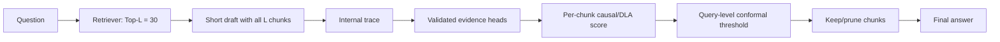

# Plan: Internal-state chunk pruning for conformal RAG

## 1. Mục tiêu

Sau khi retriever lấy một reserve pool Top-L, dùng computation bên trong generator
để quyết định chunk nào thật sự cần giữ. Conformal calibration sau đó kiểm soát
rủi ro prune nhầm support ở mức **một query**, thay vì kiểm định đồng thời L
hypothesis và chịu BY correction rất nghiêm.

MVP cố định `L = 30`. `K` không còn là một số chọn trước; nó là kích thước của
retained set sau internal scoring và conformal calibration.



Embedding scores vẫn được lưu làm baseline và retrieval prior. Quyết định chính
không dựa vào cosine similarity.

## 2. Kết luận từ hai smoke tests hiện tại

1. Khi thêm gold support, gold-token log probability tăng ở 33/39 câu và thay
   đổi mạnh nhất ở các late layers. Internal layer trajectory có chứa evidence
   signal.
2. Một head có thể dành hơn 90% chunk-attention cho support nhưng answer vẫn sai.
3. Whole-head masking của top-attention heads làm gold likelihood giảm, nhưng
   chưa khác có ý nghĩa so với random heads cùng layer.

Vì vậy raw attention chỉ được dùng để tạo một danh sách head ứng viên. Head cuối
cùng phải được chọn bằng causal effect. Chunk cuối cùng phải được chấm bằng
direct contribution hoặc chunk-specific causal masking.

## 3. Ba bài toán phải tách riêng

### 3.1 Offline head discovery

Tìm một tập nhỏ head thực sự đưa evidence từ chunk vào answer computation. Đây
là bước train-time, chạy trên tập train và không lặp lại cho mỗi test query.

### 3.2 Online chunk attribution

Với một query mới và Top-L chunks, gán score cho từng chunk. Score cao nghĩa là
chunk có khả năng là necessary support và nên được giữ.

### 3.3 Conformal retention

Dùng 1,000 câu dev để biến score thành retained set có coverage guarantee. Dev
chỉ dùng để calibrate threshold; không dùng để chọn head hoặc train scorer.

## 4. Data protocol

| Split | Được dùng cho | Không được dùng cho |
|---|---|---|
| Official train | Head discovery, causal labels, train chunk scorer | Conformal threshold, final metrics |
| 1,000 official dev queries | Conformal calibration, chọn alpha đã định trước | Train scorer, sửa feature sau khi xem test |
| Official test queries | Một lần final evaluation sau khi freeze | Tune head, model, threshold |

Mỗi dataset có head/scorer/calibration bank riêng ở MVP. Cross-dataset transfer
là experiment sau, không trộn vào kết quả chính.

Guarantee được báo cáo có điều kiện trên `support ⊆ Top-L`. Support bị retriever
bỏ ngoài Top-L là retrieval-ceiling failure và được báo riêng; pruning không thể
cứu trường hợp đó.

## 5. Offline: tìm Evidence-Use Heads bằng causal edge masking

Whole-head masking hiện tại zero toàn bộ output của head, nên có thể phá nhiều
computation không liên quan tới chunk. Thí nghiệm chính sẽ mask đúng cạnh từ
answer tokens tới một chunk:

```text
do(A[layer, head, answer_positions, chunk_span] = 0)
```

Sau khi zero attention tới chunk, attention còn lại được renormalize. Với gold
answer `y*`, causal contribution của chunk `j` qua head `(l,h)` là:

```text
Delta[q,j,l,h]
  = log p(y* | q, C)
  - log p(y* | q, do(answer -> chunk_j edge at head l,h = 0), C)
```

Một head tốt phải thỏa cả hai điều kiện:

- `Delta` dương và lớn trên labelled support chunks;
- `Delta` gần 0 hoặc âm trên rank- và modality-matched non-support chunks.

Head score trên train:

```text
HeadScore[l,h]
  = mean(Delta | support)
  - mean(Delta | matched non-support)
```

Chọn head bằng inner cross-validation trên train. Đánh giá trên train fold chưa
dùng bằng ba controls:

- top causal heads;
- random heads với cùng số head ở từng layer;
- bottom causal heads với cùng số head ở từng layer.

### Gate H1

Chỉ gọi chúng là Evidence-Use Heads nếu:

- top-head masking có effect lớn hơn layer-matched random và bottom;
- paired bootstrap interval của effect difference không chứa 0 hoặc kiểm định
  paired đạt mức đã định trước;
- head ranking có cross-fold Jaccard/stability hợp lý;
- effect xuất hiện trên answer likelihood và ít nhất một task metric.

Nếu gate này fail, không dùng sparse-head claim. Pipeline chuyển sang all-head
layer trajectory và vẫn tiếp tục chunk-scoring experiment.

## 6. Online: score từng chunk

### 6.1 Research upper bound: exact chunk intervention

1. Cho model đọc cả Top-30 và sinh draft ngắn `y`.
2. Teacher-force cùng draft để lấy baseline `log p(y | q,C)`.
3. Với mỗi chunk `j`, mask answer-to-chunk edges ở validated heads và tính lại:

```text
CausalSupport[j] = log p(y | q,C) - log p(y | q,do(mask chunk_j),C)
```

Score này cần tối đa L cached answer passes. Nó là oracle computational baseline,
không phải final fast method.

Để tránh giữ chunk chỉ vì nó củng cố một draft sai, lưu thêm:

- distribution shift/JSD khi chunk bị mask;
- layer nơi answer bắt đầu thay đổi;
- head consensus: bao nhiêu validated heads cùng cho contribution dương;
- context-versus-no-context logit trajectory;
- conflict direction: chunk đẩy prediction về hay ra xa no-context answer.

### 6.2 Fast method: chunk-level Direct Logit Attribution

Trong một cached teacher-forced pass, giữ attention và value vectors ở validated
heads. Contribution của chunk `j` tại answer token `t` là:

```text
z[l,h,j,t] = sum over i in chunk_j of A[l,h,t,i] * V[l,h,i]
r[l,h,j,t] = W_O[l,h] * z[l,h,j,t]
```

Chiếu `r` vào một contrastive answer direction:

```text
u[t] = W_U[y_t] - expectation over competing tokens of W_U[token]
DLA[l,h,j,t] = u[t]^T * T_l(r[l,h,j,t])
```

`T_l` bắt đầu bằng final RMSNorm/logit lens. Bản đầy đủ train một affine tuned
lens trên train để giảm bias của intermediate-layer projection.

Per-chunk features:

- trimmed mean và minimum DLA qua answer tokens;
- positive/negative DLA mass;
- fraction of validated heads với DLA dương;
- earliest evidence-emergence layer;
- layer-to-layer DLA stability;
- attention mass và attention entropy, chỉ làm auxiliary features;
- exact causal score cho 2-3 chunks nằm sát threshold;
- retriever/reranker score, rank, modality chỉ làm optional prior và ablation.

Một scorer nhỏ `g_theta(q, chunk_j, C, draft)` dự đoán probability chunk là
necessary support. Dùng logistic regression hoặc shallow MLP để contribution
đến từ internal features, không đến từ capacity của một reranker lớn khác.

### Gate H2

Fast DLA được chấp nhận nếu trên held-out train folds:

- correlation với exact chunk intervention cao hơn raw attention;
- support AP/AUROC cao hơn embedding-only và last-layer-average-attention;
- validated-head DLA tốt hơn all-head DLA;
- kết quả giữ được ở text và table chunks.

Nếu DLA không gần exact intervention, dùng exact masking cho experiment chính
và báo rõ latency; không giả định DLA là causal.

## 7. Conformalize việc keep/prune ở mức query

Cho `g_qj` là internal necessary-support score, cao hơn nghĩa là cần giữ. Với
calibration query `q`, gọi `S_q` là tất cả gold support chunks nằm trong Top-L.

Để bảo vệ **toàn bộ support set**, tạo một nonconformity score cho mỗi query:

```text
a_q = - min over j in S_q of g_qj
```

Tính split-conformal quantile `q_hat` trên 1,000 dev queries và đặt:

```text
tau = -q_hat
Keep(q) = {chunk_j in Top-L : g_qj >= tau}
```

Dưới exchangeability, mục tiêu là:

```text
P(S_q is a subset of Keep(q) | S_q is a subset of Top-L) >= 1 - alpha
```

Đây là một calibration score cho mỗi query. Không có L simultaneous p-values,
không cần BY correction qua 30 chunks.

Primary guarantee dùng `min support score` vì TATQA/multi-hop có thể cần nhiều
support chunks. Một secondary, ít nghiêm hơn, dùng `max support score` để bảo vệ
“ít nhất một support được giữ”, nhưng không được trình bày như all-support
coverage.

Không áp hard cap K sau conformal selection vì cap có thể xóa support và phá
coverage. Nếu cần context budget, calibrate trực tiếp rank lớn nhất của support
theo internal score hoặc báo riêng rate vượt budget.

### Empty retained set

- Nếu query-level sufficiency probe đã conformally certify rằng model không cần
  external evidence, empty context là một quyết định hợp lệ.
- Nếu probe nói retrieval cần thiết nhưng retained set rỗng, hệ thống không tự
  nhận là “đủ evidence”. Nó giữ conservative prefix hoặc abstain và ghi nhận
  calibration failure.
- Thêm một fallback chunk chỉ làm retained set lớn hơn nên không phá support
  coverage, nhưng có thể làm answer tệ hơn vì noise; fallback phải là ablation,
  không phải kết quả chính.

### Gate H3

Trên dev calibration audit và test evaluation:

- empirical all-support set coverage đạt target `1-alpha` trong sampling error;
- empty rate thấp hơn current BY selector;
- mean retained chunks thấp hơn fixed Top-10;
- answer metrics không giảm tại matched support coverage.

## 8. Kết hợp với query-level internal sufficiency

Chunk pruning và stopping dùng hai score khác nhau:

- `g_qj`: chunk `j` có phải necessary support không;
- `r_qt`: tại retrieval round `t`, answer hiện tại có unsafe-to-stop không.

Flow iterative:

1. Retrieve Top-L reserve.
2. Score và conformally retain evidence.
3. Generate answer với retained set.
4. Dùng residual/logit trajectory để classify:
   - `grounded_sufficient`: stop;
   - `retrieval_insufficient`: lấy chunk tiếp từ reserve;
   - `context_misled`: bỏ/reweight chunk có negative causal contribution;
   - `reasoning_failure`: reason lại hoặc abstain;
   - `parametric_known`: verify hoặc stop theo risk policy.
5. Calibrate false-stop risk trên full query trajectories, tách khỏi chunk-set
   coverage calibration.

## 9. Experiment matrix

| ID | Chunk score | Head choice | Conformal unit | Mục đích |
|---|---|---|---|---|
| B0 | Retriever/reranker | none | current BY | Existing baseline |
| B1 | Raw attention mass | all final-layer heads | query-set | Current attention baseline |
| B2 | Raw attention mass | top attention heads | query-set | Reproduce failed proxy |
| E1 | Exact edge masking | all measured heads | query-set | Causal upper bound |
| E2 | Exact edge masking | validated heads | query-set | Sparse causal method |
| E3 | DLA | all measured heads | query-set | Fast attribution baseline |
| E4 | DLA | validated heads | query-set | Proposed fast method |
| E5 | DLA + layer trajectory | validated heads | query-set | Proposed complete scorer |
| A1 | E5 without retriever score | validated heads | query-set | Internal-only ablation |
| A2 | E5 without DLA | validated heads | query-set | Residual/logit-only ablation |
| A3 | E5 without causal validation | attention heads | query-set | Value of causal head selection |

Run `alpha = 0.05, 0.10, 0.20` as a predeclared grid. Choose a primary alpha
before test evaluation.

## 10. Metrics

Primary:

- all-support set coverage conditional on support being in Top-L;
- harmful-prune rate;
- answer EM/F1 and TATQA numerical accuracy;
- average retained chunks and context tokens;
- empty-context rate;
- false-stop risk and risk-coverage curve.

Mechanistic:

- causal delta top vs layer-matched random/bottom heads;
- head ranking stability across folds and seeds;
- DLA-to-exact-mask Spearman correlation;
- support AP/AUROC per modality;
- evidence-emergence layer distribution;
- negative-contribution chunks among context-misled cases.

Always report retrieval ceiling: fraction of queries whose full gold support is
not contained in Top-L.

## 11. Implementation sequence and commits

### First runnable MVP

Trước khi build bank 1,000 dev queries, chạy một train-only experiment nhỏ:

1. Lấy 100 TATQA train queries có full support trong Top-30; stratify theo
   text/table và support rank.
2. Mỗi query dùng một support chunk và một non-support chunk cùng modality/rank
   band để làm causal contrast.
3. Dùng one-pass DLA để screen heads ở layers 10-24 xuống còn 16 candidates.
4. Trên 50 query discovery, chạy exact edge masking cho 16 candidates.
5. Freeze top 4/8 heads; trên 50 query còn lại so với layer-matched random và
   bottom controls.
6. Đồng thời so per-chunk ranking của raw attention, DLA và exact masking.

MVP dừng ngay nếu edge mask không thật sự chỉ thay answer-to-target-chunk edges,
hoặc nếu DLA không tốt hơn raw attention. Chỉ khi MVP qua Gate H1/H2 mới mở rộng
train data và tạo conformal bank trên 1,000 dev queries.

### Phase A — chunk-specific causal intervention

Files:

- `chunk_edge_mask.py`: mask one chunk at selected heads and renormalize;
- `build_causal_chunk_bank.py`: create train-only causal effects;
- tests for span isolation, renormalization, and hook removal.

Commit after unit tests and a 3-query GPU smoke run.

### Phase B — head discovery and controls

Files:

- `discover_evidence_heads.py`;
- fold assignments and immutable head ranking JSON;
- report comparing top/random/bottom with layer matching.

Commit code, then raw results, then analysis as separate checkpoints.

### Phase C — DLA scorer

Files:

- `chunk_dla.py`;
- `fit_chunk_scorer.py`;
- train-fold checkpoints and held-out predictions.

Do not import into `src/uncertainty_rag` until Gate H2 passes.

### Phase D — conformal calibration

Files:

- `conformal_chunk_retention.py`;
- calibration bank built from exactly 1,000 dev queries per dataset;
- alpha sweep with coverage, retained size, and empty rate.

Freeze scorer, heads, prompt, Top-L, and alpha before test.

### Phase E — final test

Run only official test queries. Compare B0/B1/E1/E4/E5 with frozen artifacts.
Import the winning implementation into the production pipeline only after the
test report is complete.

## 12. Go/no-go decision

Continue with the proposed method only when all three gates pass:

1. causal head selection beats layer-matched controls;
2. fast DLA approximates exact chunk interventions and improves support ranking;
3. query-level conformal retention achieves target support coverage with fewer
   chunks and no material answer degradation.

If Gate 1 fails again, remove the sparse-head claim and use layer-wise internal
attribution. If Gate 2 fails, exact edge masking remains the research method and
latency becomes an explicit limitation. If Gate 3 fails, the internal score is
not yet suitable for conformal pruning even if its mechanistic analysis is
interesting.

## 13. Executed pilot update

The first causal branch did not pass Gates 1-2. Layer-14/18 high-attention heads
did not beat layer-matched causal controls, and exact answer-to-chunk edge
masking produced near-random support ranking. The sparse-head causal claim is
therefore removed from the current pruning method.

A separate distributed-attention branch passed an exploratory version of Gate
3. On 120 train-only questions, averaging all-layer answer-to-chunk attention
over original and reversed context orders improved MRR from 0.613 (BGE) to
0.714. Leave-one-query-out fusion reached 0.766. In 100 disjoint three-way
train/calibration/evaluation trials at alpha 0.1, fusion retained all support for
90.9% of evaluation queries while pruning 31.8% of false candidates; BGE pruned
0.7% at 89.9% coverage.

These results justify the next development-bank run, with two constraints:

1. use the complete frozen Top-L candidates instead of the labelled
   support-plus-three-negative proxy;
2. keep training, calibration, and final evaluation queries disjoint, then
   measure downstream answer quality after pruning.

See `RESULTS_POSITION_CONTROLLED_PRUNING.md` for the full protocol, controls,
statistics, and limitations.
